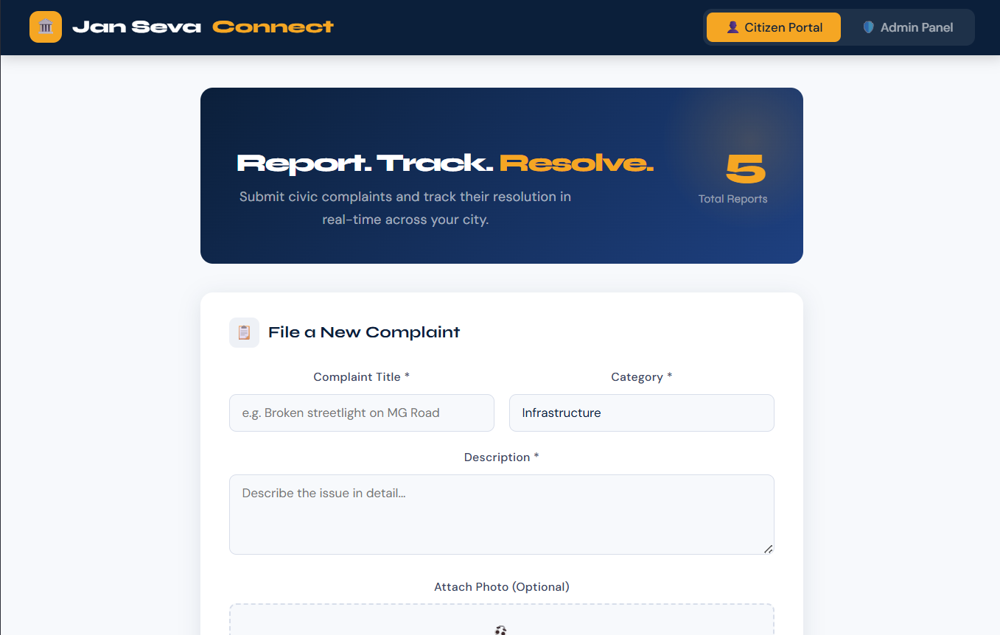

# 🏛️ Jan Seva Connect

A modern civic complaint management system built with **React**. Citizens can report issues in their locality and track resolution status, while admins can manage and update complaints efficiently.

---

## 🚀 Features

### 👤 Citizen Portal

* Submit civic complaints (roads, water, sanitation, etc.)
* Upload complaint details with category selection
* View all complaints
* Filter by status (Pending / In Progress / Resolved)
* Upvote important issues
* Track real-time status updates

### 🛡️ Admin Panel

* Dashboard with complaint statistics
* Manage all complaints in a table view
* Update status: Pending → In Progress → Resolved
* Delete complaints
* Search and filter complaints
* View detailed complaint modal

---

## 🧑‍💻 Tech Stack

* React (Vite)
* JavaScript (ES6+)
* CSS (Custom UI Design)
* Node.js + Express (Backend)
* MongoDB (Database)
* REST API

---

## 📌 Future Improvements

* 🔐 Authentication (Login/Signup)
* 🗺️ Google Maps integration for location tagging
* ☁️ Cloud deployment (Vercel / Render)
* 📷 Image upload (Cloudinary)
* 📊 Analytics dashboard

---

## 👩‍💻 Author

**Amirthavarshini H**

---

## ⭐ If you like this project

Give it a star on GitHub 😊
